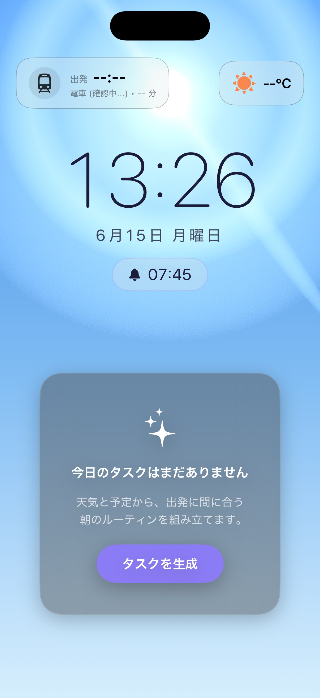
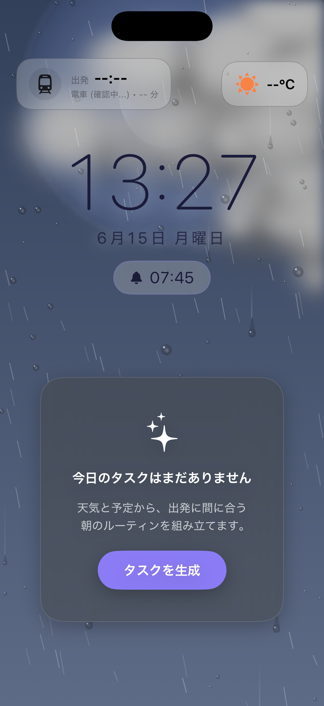
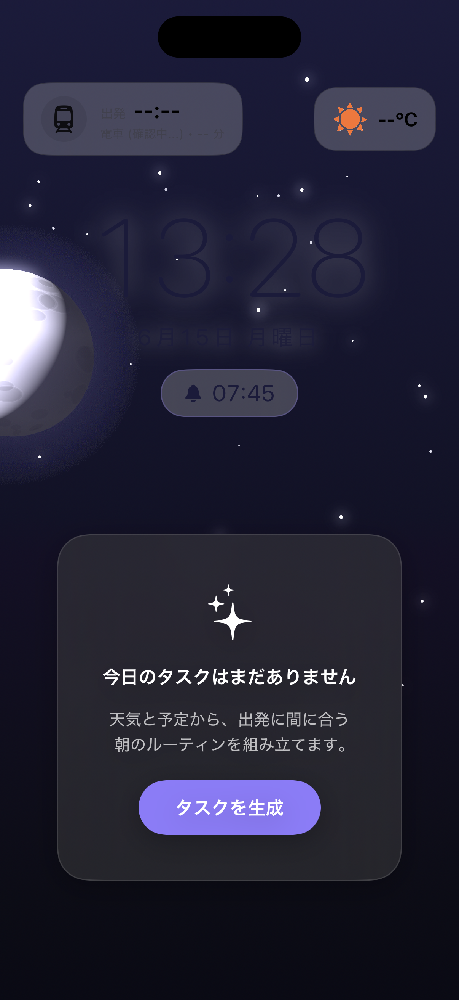
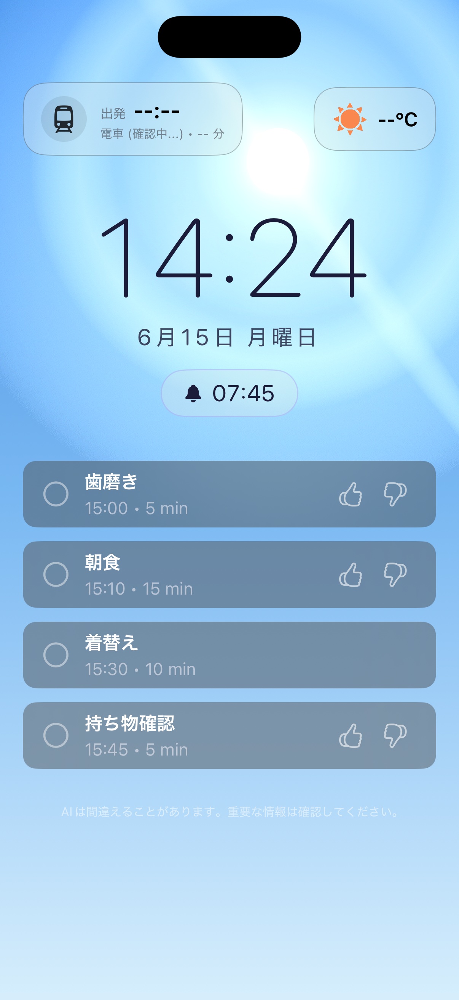
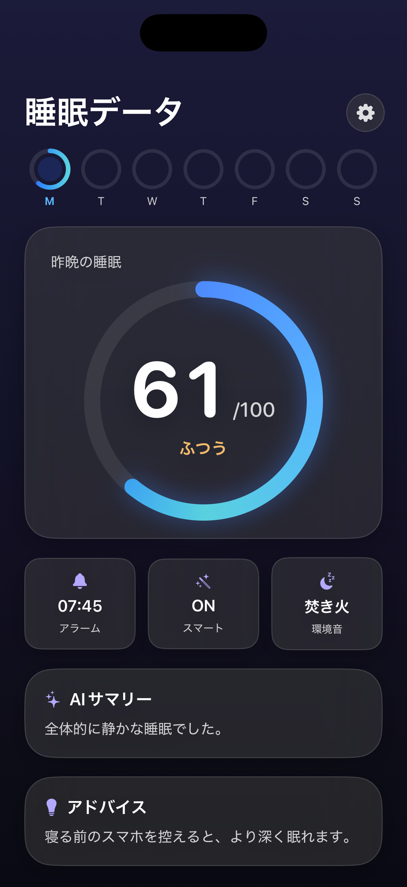

# Stellise（ステライズ）

> 毎朝の「あと5分…」からの遅刻をなくす、プライバシー重視のAIアラーム＆朝のルーティン最適化アプリ（iOS / SwiftUI）

寝坊・電車の遅延・急な天候の変化など、予測しづらい朝のルーティン崩れを、オンデバイスAIと各種APIの連携で解決します。ユーザーに我慢を強いるのではなく、「睡眠状態・天気・交通・予定」からAIが“今やるべきこと”を判断し、毎朝の最適解を提案・再計算します。

---

## スクリーンショット

| 朝（晴れ） | 朝（雨） | 夜 | タスク | 睡眠スコア |
|:---:|:---:|:---:|:---:|:---:|
|  |  |  |  |  |

背景は画像素材ではなく、**時刻と天気からSceneKitでリアルタイム生成**しています（晴れ／曇り／雨／早朝／夕方／夜で、空のグラデ・太陽/月・星・雲・雨を出し分け）。

---

## 概要（Overview）

二度寝防止アプリにありがちな「パズルや計算で無理やり脳を起こすストレス」や、AIアプリにつきまとう「個人データ流出の不安」を取り除き、**人に寄り添うアシスタント**として設計しました。

- **課題**: 朝は「起きられない」だけでなく、起きた後も「天気・遅延で予定が崩れ、何から手をつけるか迷う」ことで遅刻が起きる。
- **解決**: 起床（眠りの浅いタイミングでのアラーム）から、起床後のタスク再構成までを一気通貫で支援する。判断と段取りをAIに“代行”させ、ユーザーは迷わず動くだけにする。

---

## 主な機能（Core Features）

### 1. オンデバイスAIによる睡眠解析と最適起床
- 端末内の **TensorFlow Lite（YAMNet）** で音を分類し、**CoreMotion** の体動と合わせて睡眠の深さを推定。
- 眠りが浅いタイミングを狙ってアラームを鳴らす「スマートアラーム」。音声・体動データは**端末内で解析が完結**し、外部に送信しません。

### 2. 朝のルーティンの自動再計算（“思考の代行”）
- **天気API** と **交通／経路（CoreLocation・MapKit）** を参照し、出発時刻を算出。
- 遅延や悪天候を検知すると、AIが「何を削り・何を先にやるか」を判断し、**出発に間に合うようタスク配分を再構成**。緊急時はバナーで通知。

### 3. ストレスを与えない行動支援
- パズルや計算といった負荷ではなく、「やるべきことの取捨選択」を提示して自然に行動を促す。
- タスクは一覧で表示し、**タップで完了**（スライド＋フェードの完了アニメ）。遅刻が近いタスクはオレンジのガラス表現でやさしく警告（パルス）。

### 4. 睡眠スコアと生活リズムの可視化
- 毎晩の睡眠を100点満点でスコア化し、**ヒーローのスコアリング（カウントアップ）**＋**週リング**で推移を可視化。
- AIによる「サマリー」「アドバイス」を添えて、改善のヒントを提示。

### 5. 心地よい入眠サポート
- 環境音（焚き火・波・雨など）の再生、就寝モードの没入ダーク表示、伏せ置きでのOLEDブラックアウト（実装予定）など、寝る前から起きた後までをカバー。

---

## 画面構成（Screens）

| 画面 | 役割 |
|---|---|
| **ホーム（朝・DayView）** | 時刻・天気・出発時刻・移動手段のヘッダー、AIが組んだ朝タスク一覧。背景は天気連動の3D。 |
| **ホーム（夜・NightView）** | 就寝モード。没入ダーク＋環境音＋アラーム設定。 |
| **睡眠データ（SleepDataView）** | 睡眠スコア（リング）・週リング・睡眠時間/REM・AIサマリー/アドバイス。 |
| **アラーム（AlarmRingingView）** | 起床ミッション。夜→朝の色変化で起こす。 |
| **オンボーディング（WelcomeView ほか）** | 名前・身体情報・起床時刻・移動手段の初期設定。 |
| **設定（SettingsView）** | アラーム・スマート起床・環境音・課金などの管理。 |

---

## 技術的ハイライト（Engineering Highlights）

- **生成的な3D背景（SceneKit）**: 画像素材に頼らず、`Background3D.swift` で空のグラデーション・天体（太陽/月）・星・雲・雨をコードから生成。時刻に応じて天体が東→南中→西へ弧を描いて移動し、天気で見た目が変わる。雲は複数パフ＋陰影で立体的に、雨は降雨＋「窓ガラスに伝う水滴」まで表現。
- **オンデバイス機械学習**: `SoundAnalyzer.swift` が TensorFlow Lite（YAMNet）で音を分類、`SensorManager.swift` が CoreMotion で体動を取得。クラウド推論なしで睡眠解析を実現。
- **リアクティブな状態管理**: `AppState`（`ObservableObject`）＋ Combine を中核に、SwiftUIへ状態を一元配信。
- **デザインシステム**: `DesignSystem.swift` にカラートークン・タイポ・角丸・ガラス表現（`.glassCard()`）を集約し、画面間で一貫したトーン（紺×ブルー基調のダークUI）を担保。
- **OS連携**: App Intents（Siri/ショートカット）、EventKit（カレンダー）、UserNotifications（通知）、StoreKit（サブスク）。

---

## 技術構成（Tech Stack）

| 区分 | 使用技術 |
|---|---|
| 言語・UI | Swift / SwiftUI / Combine |
| 3D・グラフィックス | SceneKit（背景の手続き生成）、Canvas（雲・雨・水滴の描画） |
| 機械学習（オンデバイス） | TensorFlow Lite（YAMNet による音声分類） |
| センサー・位置 | CoreMotion（体動）、CoreLocation / MapKit（位置・経路） |
| 音声 | AVFoundation / AudioToolbox（環境音・アラーム・マイク入力） |
| OS連携 | App Intents、EventKit、UserNotifications、SafariServices |
| 課金 | StoreKit（サブスクリプション） |
| 認証・同期 | Firebase（Auth / Firestore） |
| 外部API | 天気API、交通／経路 |

---

## プライバシー・バイ・デザイン（Privacy by Design）

- **音声・体動の生データは端末内で完結**: 音声分類（YAMNet）と体動解析はオンデバイスで行い、**生の音声データ・センサーデータを外部へ送信しません**。
- **サーバへ送信するデータ（AIタスク提案・天気・経路計算のため）**: ニックネーム、カレンダー予定のタイトルと時刻、睡眠スコア（数値のみ）、おおよその位置情報（緯度経度）、タスクのフィードバック履歴を、Firebase匿名認証で保護された自社APIサーバに送信します。個人を特定するアカウント情報とは紐付けません。
- **学習への二次利用なし**: ユーザーのフィードバックをAIモデルの学習へ転用しません。
- **広告の排除**: アプリ内広告・トラッキングSDKは搭載していません。

---

## 実装状況・今後（Status & Roadmap）

実装済み：

- 天気連動の3D背景（晴れ／曇り／雨／早朝／夕方／夜）
- 朝タスクの一覧表示・タップ完了・各種アニメーション（登場／完了／遅刻警告）
- 睡眠スコアのヒーロー表示（週リング・睡眠時間/REMカードを含むUI）

今後の予定：

- 睡眠スコア履歴の永続化と、睡眠時間・REM・睡眠ステージの**実データ連携**（一部はUIを先行実装）
- NightView の円形タイマー刷新と OLED ブラックアウト
- オンボーディングのプリパーミッション（権限の必要性を先に説明）

---

## 開発・実行（Getting Started）

```bash
# 依存（CocoaPods）
pod install

# Stellise.xcworkspace を Xcode で開いてビルド
open Stellise.xcworkspace
```

- 実行には `GoogleService-Info.plist`（Firebase）が必要です（リポジトリには含めていません）。
- iOS シミュレータ／実機で動作します。

---

## クレジット（Credits）

- アラーム音・環境音: [OtoLogic](https://otologic.jp)（[CC BY 4.0](https://creativecommons.org/licenses/by/4.0/deed.ja)）
